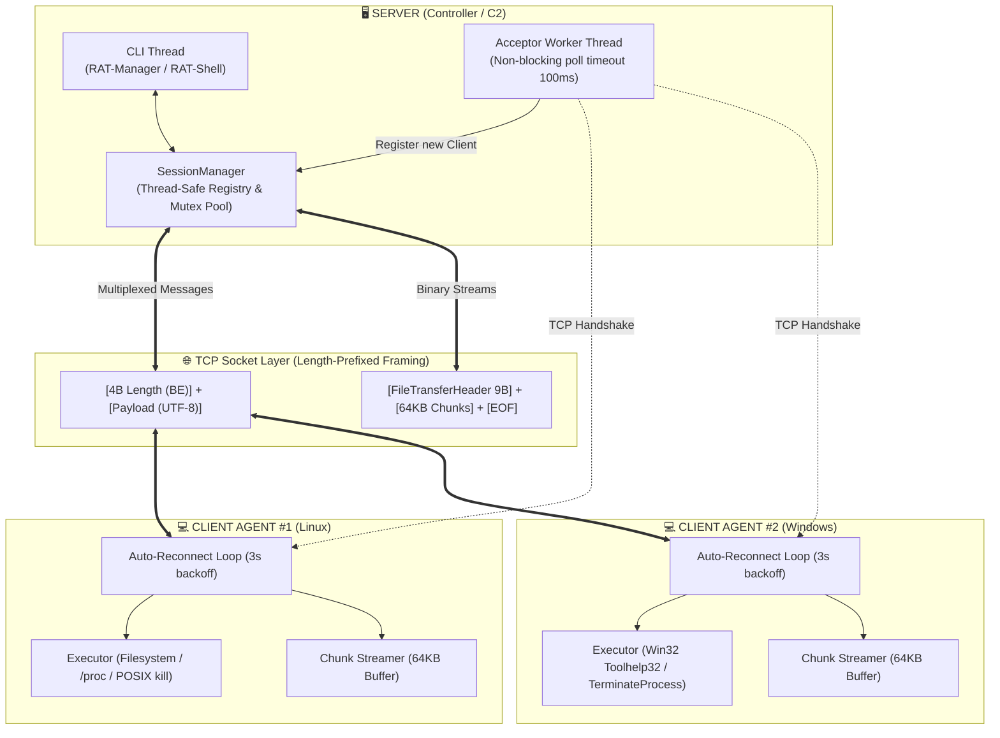

# Remote Access Tool (RAT) in C++

## Giới Thiệu

**Remote Access Tool (RAT)** là framework quản trị và điều khiển máy tính từ xa theo mô hình Client - Server được phát triển bằng **C++17**. Dự án được xây dựng gọn nhẹ, có khả năng tương thích trên cả **Linux** và **Windows**.

## Tính Năng

| Nhóm Tính Năng | Mô Tả Chi Tiết |
| :--- | :--- |
| **Multi Client** | Server tự động tiếp nhận kết nối ngầm, cấp phát Session ID, theo dõi trạng thái của Socket ngầm. |
| **Phân tầng Điều khiển** | Phân tách cấp quản trị (`RAT-Manager`) và cấp tương tác 1-1 với từng client (`RAT-Shell [Client <id>]`). |
| **Broadcast** | Gửi đồng thời cùng một tác vụ hệ thống tới toàn bộ client, và tổng hợp kết quả độc lập. |
| **Duyệt Thư mục** | Tự động bỏ qua các mục không đủ quyền, hiển thị rõ ràng loại mục (`[DIR]`/`[FILE]`) và kích thước. |
| **Đọc File** | Đọc nhanh nội dung file text/config với giới hạn dung lượng 2MB nhằm ngăn chặn cạn kiệt RAM và băng thông. |
| **Truyền File** | Tải file nhị phân lớn từ xa về máy chủ theo luồng 64KB. |
| **Quản lý Tiến trình** | **Linux:** Phân tích hệ thống tệp ảo `/proc` và gửi tín hiệu `SIGKILL`.<br>**Windows:** Sử dụng Win32 Toolhelp32 Snapshot (`CreateToolhelp32Snapshot`) và `TerminateProcess`. |

---

## Kiến Trúc Hệ Thống

Dự án áp dụng mô hình hướng dịch vụ phân tán, chia thành 3 lớp chính:




## Giao Thức Truyền Thông

### 1. Cấu trúc Gói Tin (Text Messages)

Mỗi thông điệp văn bản đều có header 4-byte biểu diễn độ dài thực tế:

```text
+-------------------------+------------------------------------------+
|  Độ dài Payload (4B)   |            Nội dung Payload              |
|   uint32_t (Big-Endian) |          Chuỗi ký tự văn bản             |
+-------------------------+------------------------------------------+
|<----- HEADER_SIZE ----->|<------------- MAX: 10 MB --------------->|
```

- **Độ dài tối đa (`MAX_MESSAGE_SIZE`):** 10 MB (10,485,760 bytes).
- **Quy chuẩn thứ tự byte:** Sử dụng `htonl()` trước khi truyền và `ntohl()` sau khi tiếp nhận.

### 2. Giao thức Truyền Tệp Tin 

```text
[BƯỚC 1: BẮT TAY]
Client ───► Server : FileTransferHeader (9 Bytes)
                     ├── uint8_t  status_code (0: OK, 1: Not Found, 2: Access Denied)
                     └── uint64_t file_size   (Chuẩn hóa 64-bit Network Endian)

[BƯỚC 2: STREAM DỮ LIỆU PHÂN MẢNH THEO VÒNG LẶP]
Client ───► Server : [Chunk Length: 4 Bytes (uint32_t BE)] + [Binary Data: Tối đa 64 KB]
Client ───► Server : [Chunk Length: 4 Bytes (uint32_t BE)] + [Binary Data: Tối đa 64 KB]
...

[BƯỚC 3: DẤU HIỆU KẾT THÚC (EOF MARKER)]
Client ───► Server : [Chunk Length: 0x00000000 (4 Bytes = 0)]
```

---

## Cấu Trúc Thư Mục Dự Án

```text
RAT/
├── CMakeLists.txt              # Cấu hình biên dịch
├── toolchain-windows.cmake     # CMake toolchain hỗ trợ cross-compile Windows bằng MinGW
├── README.md             
│
├── common/                     # Module dùng chung giữa Server và Client
│   ├── platform.h              # Giao thức chung giữa các OS
│   ├── protocol.h              # Hằng số giao thức, mã lệnh, cấu trúc FileTransferHeader
│   ├── socket_utils.h          # Khai báo hàm truyền nhận an toàn (exact I/O, message, stream)
│   └── socket_utils.cpp        # Cài đặt hàm send_exact, recv_exact, send/recv_file_stream
│
├── server/                     # Máy chủ
│   ├── session_manager.h       # Quản lý danh sách kết nối Client
│   ├── session_manager.cpp     
│   ├── server.h                # Khai báo lớp Server 
│   ├── server.cpp              # Cài đặt xử lý mạng, Shell quản trị và truyền file
│   └── main_server.cpp         # Hàm khởi động Server
│
├── client/                     # Client
│   ├── executor.h              # Khai báo tác vụ hệ thống (Filesystem, Process management)
│   ├── executor.cpp            # Cài đặt chi tiết cho Linux (/proc, kill) và Windows (Toolhelp32)
│   ├── client.h                # Khai báo lớp Client 
│   ├── client.cpp              # Cài đặt kết nối, các lệnh và stream dữ liệu
│   └── main_client.cpp         # Hàm khởi động Client 
│
└── tests/                      # Unit Test (Google Test)
    ├── test_compat.h           # Giả lập socketpair cho cả Linux và Windows Loopback
    ├── test_main.cpp           # Hàm khởi chạy bộ kiểm thử GTest Runner
    ├── test_protocol.cpp       # Kiểm thử các hằng số, kích thước header và Endian
    ├── test_socket_utils.cpp   # Kiểm thử truyền nhận thông điệp qua Virtual Socket
    ├── test_executor.cpp       # Kiểm thử tác vụ hệ thống (đọc file, duyệt thư mục, kill)
    ├── test_file_transfer.cpp  # Kiểm thử truyền file nhị phân (>5MB) qua socket
    └── test_server.cpp         # Kiểm thử SessionManager và vòng đời Server
```

---

## Bảng Lệnh (CLI Reference)

Hệ thống giao diện dòng lệnh được chia làm 2 cấp:

### 1. Tầng Quản Trị Hệ Thống (`RAT-Manager>`)

Dùng để quản lý các máy trạm đang kết nối.

| Lệnh | Cú pháp | Ý nghĩa & Hành vi |
| :--- | :--- | :--- |
| `SESSIONS` | `SESSIONS` hoặc `list` | Quét kiểm tra trạng thái Socket và in bảng danh sách các Client đang online |
| `INTERACT` | `INTERACT <id>` | Chuyển sang chế độ tương tác trực tiếp 1-1 với máy đích mang ID chỉ định. |
| `BROADCAST` | `BROADCAST <command>` | Gửi lệnh song song tới các Client đang online và gom kết quả hiển thị. |
| `HELP` | `HELP` | Hiển thị bảng trợ giúp các lệnh. |
| `EXIT` | `EXIT` hoặc `exit` | Gửi tín hiệu ngắt kết nối an toàn tới toàn bộ Client và tắt Server. |

### 2. Tầng Tương Tác 1-1 (`RAT-Shell [Client <id>]>`)

Dùng khi tương tác trực tiếp với một máy Client cụ thể sau lệnh `INTERACT <id>`.

| Lệnh | Tham số | Mô tả chức năng | Ví dụ minh họa |
| :--- | :--- | :--- | :--- |
| `LIST_DIR` | `[path]` | Liệt kê danh sách file/folder. Mặc định là thư mục hiện tại (`.`) nếu để trống. | `LIST_DIR /var/log` |
| `READ_FILE` | `<path>` | Đọc nội dung file văn bản dưới dạng UTF-8 (giới hạn tối đa 2MB). | `READ_FILE /etc/hostname` |
| `DOWNLOAD_FILE` | `<remote> <local>` | Tải file nhị phân từ máy Client về lưu tại ổ đĩa máy Server theo từng khối 64KB. | `DOWNLOAD_FILE /bin/bash ./downloaded_bash` |
| `LIST_PROC` |  | Liệt kê tất cả các tiến trình hệ thống đang chạy (PID và Tên chương trình). | `LIST_PROC` |
| `KILL_PROC` | `<pid>` | Dừng tiến trình theo mã PID (`SIGKILL` trên Linux / `TerminateProcess` trên Win). | `KILL_PROC 1234` |
| `BACK` |  | Thoát khỏi tương tác riêng lẻ để quay về menu `RAT-Manager>`. | `BACK` |
| `HELP` |  | In ra danh sách các lệnh shell của Client. | `HELP` |
| `EXIT` |  | Yêu cầu Client đóng kết nối. | `EXIT` |

---

## Yêu Cầu Môi Trường & Công Cụ

### Môi trường Linux:
- **Trình biên dịch:** GCC 8.0+ hoặc Clang 7.0+ (chuẩn C++17).
- **Build System:** CMake 3.16+ và GNU Make / Ninja.
- **Thư viện hệ thống:** `pthread` (tích hợp sẵn trong glibc).
- **Kết nối mạng Internet:** Để CMake tự động tải Google Test qua `FetchContent`.

### Môi trường Windows:
- **MinGW-w64** (với runtime GCC 8+) hoặc **Microsoft Visual C++ (MSVC 2019/2022)**.
- **Thư viện mạng:** `ws2_32` (Windows Sockets 2 API).

---

## Hướng Dẫn Biên Dịch

### 1. Biên dịch Native trên Linux

```bash
# 1. Cài đặt các công cụ cần thiết (Ubuntu/Debian)
sudo apt update && sudo apt install -y build-essential cmake git

# 2. Tạo thư mục build độc lập
mkdir -p build && cd build

# 3. Cấu hình CMake (tự động tải Google Test v1.14.0)
cmake ..

# 4. Biên dịch toàn bộ dự án 
make -j$(nproc)
```

Sau khi hoàn tất, các file thực thi sẽ nằm trong thư mục `build/`:
- `bin_server`: Chương trình điều khiển trung tâm (Server)
- `bin_client`: Mã thực thi của Agent (Client)
- `rat_unit_tests`: Bộ kiểm thử tự động

---

### 2. Cross-Compile sang Windows (PE `.exe`) từ Linux

Dự án cung cấp cấu hình Toolchain `toolchain-windows.cmake` giúp build ra file `.exe` chạy trên Windows trực tiếp từ Linux:

```bash
# 1. Cài đặt trình biên dịch MinGW cross-compiler
sudo apt install -y mingw-w64

# 2. Tạo thư mục build riêng cho Windows
mkdir -p build-win && cd build-win

# 3. Cấu hình CMake với Toolchain Windows
cmake -DCMAKE_TOOLCHAIN_FILE=../toolchain-windows.cmake ..

# 4. Tiến hành biên dịch
make -j$(nproc)
```

---

## Hướng Dẫn Sử Dụng Chi Tiết

### 1. Khởi chạy Server (Controller)

Trên máy chủ quản trị, khởi chạy chương trình `bin_server` (mặc định lắng nghe trên cổng `8888`):

```bash
./build/bin_server
```

### 2. Khởi chạy Client (Agent)

Trên các máy trạm cần quản trị, khởi chạy `bin_client`. Có thể tùy biến địa chỉ IP và Cổng của Server:

```bash
# Cú pháp: ./bin_client [IP_SERVER] [PORT_SERVER]

# Kết nối tới Server trên cùng máy (Loopback):
./build/bin_client 127.0.0.1 8888

# Kết nối tới Server trong mạng nội bộ LAN:
./build/bin_client 192.168.1.100 8888
```

---


## Unit Tests

Dự án dùng **Google Test (GTest)** và **CTest**:

```bash
# Thực thi toàn bộ test qua công cụ CTest
ctest --test-dir build --output-on-failure
```


